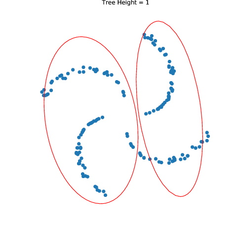

# Density Forest 
Code Repository of the EPFL SIE Master Project, Spring Semester 2018

Implementation of Density Forests for splitting n-dimensional points in regions of high Gaussianity

 

The goal of this project is to perform error detection and novelty detection using Density Forests. Applications to the MNIST dataset and a dataset for semantic segmentation of land cover classes in Zurich are visualized in  `Code/` and `Zurich/`. 

## Usage of DensityTree:
```python
from density_forest.density_forest import DensityForest

clf_df = DensityForest()  # create new class instance
clf_df.fit(X_train)       # fit to a training set
conf = clf_df(X_test)     # get confidence values for test set
```

## File Structure
### `Code/`: 
Visualizations of basic functionalities
- `decision_tree.ipynb`: Decision Trees and Random Forest on randomly generated labelled data
- `density_tree.ipynb`: Density Trees on randomly generated unlabelled data
- `MNIST Novelty Detection.ipynb`: Training of a CNN on the MNIST dataset leaving out one class, retrieval of the FC layer activations, comparison of novelty detection methods
- `MNIST Novelty Detection.ipynb`: Training of a CNN on the MNIST dataset, retrieval of the FC layer activations, comparison of error detection methods

#### `Code/density_forest/`

Package for implementation of Decision Trees, Random Forests, Density Trees and Density Forests
- `create_data.py`: functions for generating labelled and unlabelled data
- `decision_tree.py`: data structure for decision tree nodes
- `decision_tree_create.py`: functions for generating decision trees
- `decision_tree_traverse.py`: functions for traversing a decision tree to predict labels
- `density_tree.py`: data struture for density tree nodes
- `density_tree_create.py`: functions for generating density trees
- `density_tree_traverse.py`: functions for descending density trees and retreiving their Gaussian parameters
- `density_forest.py`: functions for creating density forests
- `helper.py`: helper functions
- `plots.py`: functions for plotting the data
- `random_forests`: functions for creating random forests


### `Zurich/`
- `Zurich Dataset Data Loading.ipynb`: CNN and data loading illustration for semantic segmentation on the 
"Zurich Summer v1.0" dataset (cf. `Zurich_dataset/README`)
- `Zurich Dataset Error Detection.ipynb`: Methods for error detection
- `Zurich Dataset Novelty Detection.ipynb`: Methods for novelty detection

#### `Zurich Land Cover/helpers`: 
General helpers library for semantic segmentation
- `data_augment.py`: custom data augmentation methods applied to both the image and the ground truth
- `helpers.py`: functions for importing, cropping, padding images and other related image tranformations
- `plots.py`: plotter functions for 2D and 3D plots 


#### `Zurich Land Cover/keras_helpers`
Helper functions for Keras
- `helpers.py`: get activations
- `callbacks.py`: callbacks to be evaluated after each epoch
- `unet.py`: UNET model for training of network on Zurich dataset
- `MLP.py`: MLP for Image Transformation Baseline


## Supervisors:
- Prof. Devis Tuia, University of Wageningen
- Diego Marcos González, University of Wageningen
- Prof. François Golay, EPFL

Cyril Wendl, 2018
